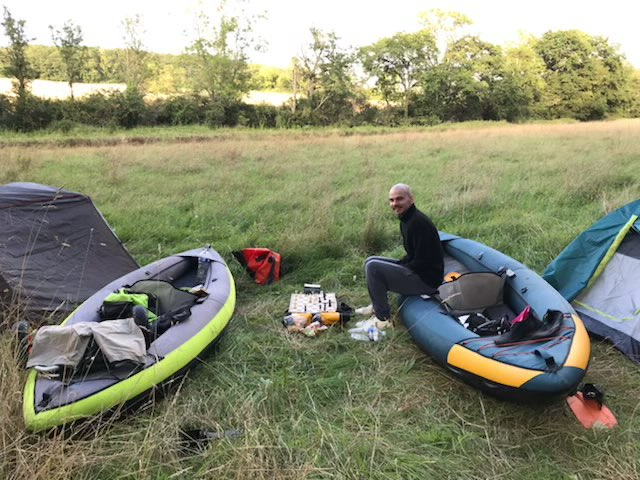

Hello ! 

J’ai tenté de passer de zéro à 1000 sur Chess.com. C'est-à-dire, de, je connais en partie les règles et n’ai pas joué depuis +10 ans, à je m’en sors bien face à 80% des gens. Cette expérience m’a beaucoup marquée. Est-ce que j’y suis parvenu ?
<h1>Contexte</h1>
Lors d’un weekend en famille, j’ai fait une partie contre <a href="https://www.instagram.com/balochex/?hl=en">@balochex</a>. Puis contre <a href="https://www.instagram.com/alylfvre/">@alylfvre</a>. Et je me suis fait éclater. J’ai juste perdu toutes mes parties. J’étais vraiment nul.

Mais, j’ai découvert un nouveau format : le blitz. Fini les parties interminables où chaque joueur met 4h à avancer. Dans ce format, chacun dispose de 5 minutes de temps de jeu. La partie va vite, et c’est prenant. 

La semaine suivante, je partais en trek-canoë avec mon frère. Il m’avait partagé plusieurs fois des extraits de partie d’échecs de Magnus Carlsen dans l’année. Je savais donc qu’il avait un intérêt pour le jeu. 

Nous allions avoir des temps morts. 

Du coup. 

Un tour en ville.

Et me voilà équipé d’un jeu portable, un timer, et un livre sur les bases !

<h1>Déroulé</h1>
Du jour au lendemain, j’ai plongé dans les échecs. 

Lors de notre trek en canoë, on a beaucoup joué les premiers jours. Le midi, je lisais “Bien débuter aux échecs”. Et quand je suis rentré, les échecs sont devenus mon obsession du moment.

J’ai joué à fond pendant à peu près un mois.

Puis j’ai arrêté comme j’avais commencé : du jour en lendemain.

Une partie d’échecs au bord de l’Orne avec mon frère

<h1>Comment progresser</h1>
Au début, je me suis lancé sans réelle stratégie. 

Je me suis procuré un livre sur les bases, un jeu d’échecs, et j’ai créé un compte sur Chess.com. Je jouais et lisais, mais ce n’était pas structuré.

Au fil de l’eau, j’ai reconnecté mon expérience avec les conseils partagés par Josh Kaufman dans “The First 20 Hours: How to Learn Anything . . . Fast!” et les leçons partagées par Ulysse Lubin dans ses <a href="https://www.ulysselubin.com/blog/100">challenges</a>.

Au bout du compte, j’ai identifié les éléments suivants. 
<ul><li>
<strong>Entretenir l’inspiration : </strong>la série “The Queen Gambit” et le livre “Le joueur d’échecs” de Stefan Zweig m’ont inspiré. Plonger dans des œuvres de fictions a participé à me faire entrer en immersion dans la discipline. Je remarque que cela fonctionne pour tous les domaines : lire “On Writing” de Stephen King est une bonne façon de commencer son voyage dans l’écriture. Lire la biographie de Steve Jobs est une bonne façon d’entrer dans la discipline du “Produit”. 
</li></ul>

<ul><li>
<strong>Établir la “table des matières” (outline) la discipline</strong> pour en cerner les contours, se faire une idée du chemin à parcourir afin de devenir un “expert” sur la théorie. Pour cela, je me suis aidé de ChatGPT. J’utilise souvent le prompt suivant :
</li></ul><blockquote>
Je souhaite acquérrir les bases de [DISCIPLINE]. Peux-tu générer la outline de la discipline avec 3 niveaux d'imbrications ? Tu peux présenter le résultat sous la forme de listes imbriquées.
</blockquote>

<ul><li>
<strong>Documenter chaque concept rencontré dans mon “second cerveau” : </strong>au fil de l’eau, je capturais dans une liste tous les concepts rencontrés. Ensuite, je les documentais et les clarifiais. Faire cela m’a permis d’acquérir rapidement le vocabulaire des échecs et d’organiser les conseils stratégiques autour de chaque concept. 
</li></ul>

Outline (à gauche) et graphe (à droite) de mes notes sur les échecs dans Obsidian.

Ma fiche sur la Tour : j’y ai regroupé les conseils stratégiques récoltés au fil de l’eau comme “aime les colonnes ouvertes”. On voit aussi en bas de note que la tour est mentionnée dans la fiche sur le clouage. Et oui, la tour peut par exemple clouer la dame sur le roi.

<ul><li>
<strong>S’échauffer avec de courtes sessions de pratique intentionnelles</strong> : commencer chaque séance de pratique par une minute d’entrainement à la lecture de l’échiquier grâce au <a href="https://www.chess.com/vision">mode d’entrainement vision</a>. Apprendre à lire l’échiquier naturellement est fastidieux. S’entraîner à lire pendant de longues sessions et ennuyant. Mais des sessions régulières d’une minute suffisent à acquérir cette compétence rapidement. De façon plus générale, certains développeurs commencent leur journée de travail avec un CodeKata pour s’échauffer. C’est la même idée.
</li></ul>

<ul><li>
<strong>Travailler la tactique grâce aux problèmes</strong>. Chess.com propose de nombreux problèmes ou “puzzles”.  En faire beaucoup permet de reconnaître les situations qui offrent des opportunités tactiques. On parle parfois de “thèmes tactiques” et de “pattern matching”. 
</li></ul>

<ul><li>
<strong>Regarder des parties pédagogiques</strong>. J’adore les vidéos partagées par Kévin Bordi sur sa chaîne BlitzStream. Les parties pédagogiques sont un excellent moyen de progresser.  C’est un format qui est à la fois divertissant et intéressant puisque Kevin partage des conseils tactiques et stratégiques en situation, au fil de l’eau. Un point fort de sa pédagogie est que dans ses vidéos pour les débutants, il se concentre sur les bases : le minimum vital qu’il te faut pour survivre dans la jungle des débutants. Cette approche permet de garder les idées claires et de ne pas s’embrouiller avec des concepts avancés quand tu galères déjà à aligner deux pas. 
</li></ul>

<ul><li>
<strong>Pratiquer</strong>. Depuis que j’ai lu “How to learn anything fast”, j’ai toujours en tête le schéma ci-dessous : la théorie renforce la pratique, mais seule la pratique permet d’acquérir une compétence. Tu peux lire tous les livres que tu veux. Si tu ne pratiques pas, tu ne vas pas progresser. J’ai joué 350 parties sur le mois. Cela fait une moyenne de 3,5 partie par jour. Avec le recul, cela ne me paraît même pas tant que ça. Mais clairement, pratiquer m’a permis de progresser :) 
</li></ul>

Le mécanisme d’acquisition de compétence

Ces techniques peuvent ensuite être organisées en brique d’entraînement et assemblées dans un programme. Voici quelques exemples.

Heure de pratique
<ul><li>
Exercice de vision (1 min)
</li><li>
Puzzles (24 min)
</li><li>
Pause (5 min)
</li><li>
Parties rapides (25 min)
</li><li>
Pause (5 min)
</li></ul>

Heure théorie + pratique
<ul><li>
Parties pédagogiques (25 min)
</li><li>
Pause (5 min)
</li><li>
Parties rapides (25 min)
</li><li>
Pause (5 min)
</li></ul>

Heure ciblée
<ul><li>
Puzzles centrés sur un thème (ex : faire mat avec un roi et dame, faire mat avec roi et tour, faire mat avec deux tours, …) (25 min)
</li><li>
Pause (5 min)
</li><li>
Parties rapides (25 min)
</li><li>
Pause (5 min)

</li></ul>
Les points à travailler émergent souvent des parties rapides. Si tu t’es fait avoir en fin de partie car tu as fait pat avec ton roi et ta tour, tu peux ajouter le Mat Tour-Roi à ta liste de thèmes à travailler :).
<h1>Bilan</h1>
À la fin du mois, j’ai atteint le niveau 500 sur Chess.com. 

On est loin du niveau visé. Je ne suis pas sorti de la mêlée. Je suis même en plein dedans. Mais je suis tout de même content du chemin parcouru.

Mon classement sur chess.com à la fin du mois. Je suis mieux classé que 35% des inscrits ! ou moins bien classé que 65% des inscrits. Tout dépend de comment on voit les choses ^^.

Parmi les choses qui ont bien marché, je vois en particulier ces 3 points : 
<ul><li>
une approche hyper-focus (je vivais échec)
</li><li>
se concentrer sur les bases (et laisser de côté les concepts avancés)
</li><li>
un bon équilibre entre théorie et pratique
</li></ul>

Plonger à fond dans une discipline sur une période de temps courte était une expérience incroyable. Je pense que si j’avais été organisé dès le départ, j’aurais pu atteindre le 80ᵉ centile. La démonstration reste à faire sur une prochaine expérience. Mais j’y crois.

J’ai réalisé qu’apprendre de nouvelles choses est une compétence. En général, on a peur de se lancer. Mais en ciblant un seul problème, et en mélangeant théorie et pratique sur une période de temps pas si longue, il est possible de progresser  rapidement.

Enfin, le cas de <a href="https://www.youtube.com/channel/UCcXH6W9ey_h8LEx2lFxp5fg">Kevin Bordi</a> de la chaîne  Blitzstream m’a inspiré. 

Il stream depuis des années avec régularité. Beaucoup de ses lives ne sont pas préparés, il partage simplement ce qu'il sait déjà au moment où les coups viennent. Et partager/enseigner les bases lui permettent de les consolider dans sa tête. 

Dans cette veine, j’ai commencé à publier des screencast de code kata. Je me suis donné pour objectif d’en faire 10 dans un premier temps. <a href="https://www.youtube.com/@a-petit/featured">J’en suis à 5 à ce jour</a>. Et cela fera l’objet d’une prochaine newsletter :).   Merci de m’avoir lu jusqu’ici !  Si tu penses que cet article peut intéresser quelqu’un, n’hésites pas à 
<ul><li>
le transférer 
</li><li>
le partager
</li></ul>
Et pour s’inscrite, c’est ici 

Thanks for reading 100 produits! Subscribe for free to receive new posts and support my work.

<form class="subscription-widget-subscribe"><input class="email-input" name="email" placeholder="Type your email…" tabindex="-1" type="email"/><input class="button primary" type="submit" value="Subscribe"/>

</form>

<a class="button primary" href="https://100produits.substack.com/subscribe?">Subscribe now</a>

À la prochaine :)

