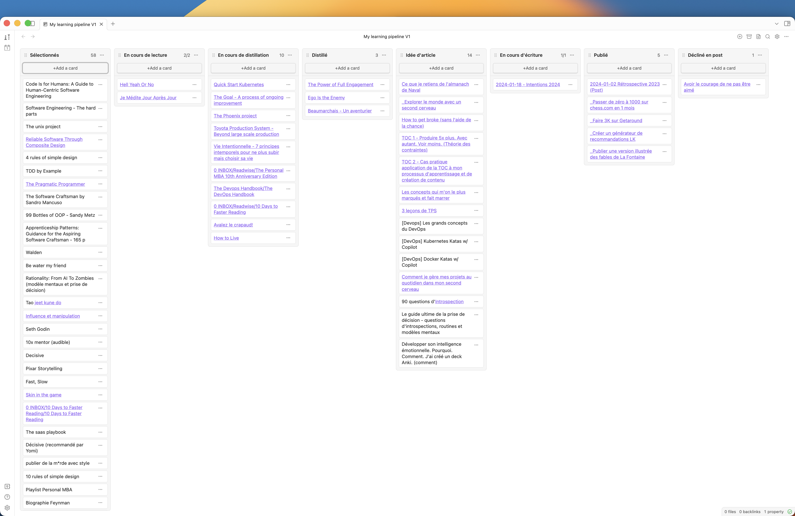

Hello ! 

La semaine dernière, on a passé en revue les principes de la théorie de contraintes. 

Cette semaine, j'ai appliqué la méthode à mon processus de création de contenu. 

Et vous allez voir, les résultats sont surprenants. 

<h1>Rappels</h1>
Pour rappel, les grandes étapes de la méthode sont les suivantes : 

1. Définir le but

2. Identifier la contrainte

3. Exploiter la contrainte

4. Subordonner les opérations à la contrainte

5. Élever la contrainte

6. Répéter avec la contrainte suivante

Cette méthode comporte 3 grandes phases que je me représente de cette façon : 

On identifie d'abord le but. Puis la contrainte. On l'optimise en considérant trois angles (exploiter, subordonner, élever). Et on répète avec la contrainte suivante. De temps en temps, il peut être intéressant de vérifier que notre but n'a pas changé. 
<h1>Mise en pratique</h1><h2>Quel est mon but ?</h2>
Bonne question. 

Est-il 
<ul><li>
de développer ma crédibilité ?
</li><li>
de générer des opportunités professionnelles ?
</li><li>
d'apprendre ?
</li><li>
de faire de l'argent ?
</li><li>
de développer une communauté ?
</li><li>
de vendre des produits ?
</li><li>
de gagner en statut ?
</li><li>
de partager mes expériences ?
</li><li>
de mieux réfléchir ?
</li><li>
de rencontrer des personnes partageant mon état d'esprit ?
</li><li>
de me faire des amis ?
</li></ul>
Écrire en ligne permet chacune de ces choses. 

Mais je pense que mon principal objectif est d'apprendre. 

Viser de créer du contenu me donne un cadre afin de moins m'éparpiller. Cela me donne une raison supplémentaire de lire. Reformuler ce que je lis me permet d'identifier les parties le plus importantes. Et publier en ligne est un prétexte pour prendre le temps d'étudier les sujets qui sont importants pour moi, aller au fond des choses, et tirer les leçons de mes expériences.

OK, mon objectif est donc d'apprendre.

Et ensuite, quelle est ma contrainte ?

<h2>Identifier la contrainte</h2>
Pour identifier ma contrainte, j'ai commencé par mettre à plat ma chaîne de valeur.

L'image ci-dessus représente le Kanban de mon flux d'apprentissage. Je sélectionne des livres. Je les lis. Je les digère en les décomposant en notes autoportantes (voir <a href="https://100produits.substack.com/p/explorer-le-monde-avec-un-second">Explorer le monde avec un second cerveau</a>). Cela me donne des idées d'article. Je les écris un par un, les publie, puis ma stratégie éditoriale est de les décliner sur LinkedIn afin de donner de la visibilité à mes activités.

Cette mise à plat me permet d'identifier les étapes qui sont mes principales contraintes : 
<ol><li>
<strong>l'écriture</strong> : mes lectures, mes notes et idées d'articles s'accumulent en amont de la phase "écriture" où j'ai actuellement une capacité d'un article par semaine — dans les bonnes semaines.
</li><li>
<strong>la déclinaison en post pour la diffusion</strong> : depuis janvier, je me suis concentré sur la newsletter afin d'écrire depuis un coin de la carte, sans me confronter à l'idée de m'exposer, et sans chercher à définir une ligne éditoriale claire. 
</li></ol>
C'est amusant, car les goulots d'étranglement ne sont pas là où je le pensais.

J'ai tendance à beaucoup lire. Si je me laissais aller, je ne ferais que ça. C'est mon chemin de moindre résistance. Dès que j'ai un instant, je tends naturellement à me mettre dans un endroit calme et plonger dans un livre. 

Prendre des notes, écrire et mettre en pratique sont des activités qui me demandent davantage d'effort. 

Ces dernières semaines, j'ai consacré plus de temps à distiller mes notes car je pensais que c'était là mon principal bottleneck. Mais de toute évidence, mon facteur limitant est au niveau de l'écriture.

<h2>Exploiter la contrainte</h2>
Écrire est ma principale contrainte.

Avant de considérer d'y consacrer plus de ressources, je peux déjà voir comment tirer le meilleur parti du temps dont je dispose déjà. 

Voici quelques actions que j'ai mises en place : 
<ul><li>
<strong>alimenter une piscine d'idées</strong> où je capture les idées d'articles que je pourrais publier afin de toujours avoir un sujet prêt à creuser et en pas me lancer en quête d'idée au moment d'écrire.
</li><li>
<strong>commencer par 10 minutes de méditation</strong> pour être pleinement concentré pendant 1h
</li><li>
<strong>couper toutes les notifications de mon téléphone</strong> pour ne pas être interrompu
</li><li>
<strong>couper d'internet</strong> pour ne pas être aspiré dans un <em>rabbit hole</em>. Le fait de lire régulièrement et de distiller les notes que je prends sur mes lectures assure que je dispose de plus de 50% de la matière première pour mon article au moment de l'écrire. Si une information me manque, je peux toujours faire de tête et vérifier ensuite.
</li></ul>

<h2>Subordonner les opérations à la contrainte</h2>
Là, ça devient intéressant. 

Lorsque j'ai commencé à travailler dans mon second cerveau, ma chaîne de valeur devait avoir cette forme-là : une espèce d'entonnoir avec beaucoup d'inputs (livres, podcasts), quelques notes, et peu de publications. 

Ma liste de livres sélectionnés s'étend loin en dessous de l'écran, les livres lus s'accumulent dans la colonne "en cours de distillation", et on observe un déséquilibre fort entre la quantité d'entrée et la quantité de sorties.

Pour bien fonctionner, le corps a besoin d'inspirer et d'expirer. 

Pour bien fonctionner, le cerveau a besoin d'inspiration et de création. 

Une des révélations du Lean Manufacturing est que le travail qui s'accumule entre deux opérations est une source de gâchis. L'objectif d'une chaîne de production est de fluidifier les opérations et l'écoulement des items. Il est bon d'en avoir un peu de stock entre chaque étape pour constituer un buffer et garantir que l'opérateur en aval puisse continuer à avancer en cas de problème sur l'opérateur en amont. Mais ce buffer ne doit pas dépasser une taille raisonnable. 

Appliqué à mon pipeline, je réalise que lire des dizaines de livres sans prendre des notes, sans les mettre en pratique, et sans partager ce que j'en retiens est une source de gâchis. 

Voici les actions que je mets désormais en œuvre afin de réduire l'empilement en amont de la phase d'écriture : 
<ul><li>
<strong>Durcir les critères de sélection de mes inputs</strong> : il n’y a rien de pire que de faire bien un truc que tu aurais dû ne pas faire du tout. Je lis essentiellement des livres et essaye de choisir les ouvrages de références. Je me désabonne facilement d'une newsletter ou d'un compte qui ne m'intéresse plus ou ne m'inspire plus.
</li><li>
<strong>Réduire le temps passé à consommer</strong> : tu ne peux pas juste inspirer, inspirer, inspirer. Lorsque je prends les transports, mais ai déjà 4-5 livres en attente d'être distillés, je préfère ne rien faire, contempler le paysage, écouter un divertissement, ou lire de la fiction plutôt qu'ajouter les notes d'un audio book dans le pipeline. 
</li><li>
<strong>Travailler par séries</strong> : ouvrir différents sujets conduit à de l'éparpillement et demande un effort de distillation supplémentaire. Dans <a href="https://100produits.substack.com/p/mes-intentions-pour-2024">mes intentions pour 2024</a>, j'ai identifié au préalable six sujets que je veux creuser cette année. Pour chaque sujet, j'ai constitué une liste de ressource. Je me discipline à explorer les sujets de façon séquentielle afin de simplifier le travail et distillation et permettre à mon esprit de digérer mes lectures.
</li><li>
<strong>Améliorer l'efficacité de ma prise de note</strong> : une meilleure prise de note simplifie le travail de distillation. En ciblant mieux les informations à retenir (ce qui réduit la quantité de notes à distiller) et en les structurant mieux (ce qui facilite de travail de remise en forme).
</li></ul>

<h2>Élever la contrainte</h2>
La façon la plus évidente d'élever cette contrainte est d'allouer plus de ressources à l'écriture. Ici, c'est-à-dire d'y passer plus de temps. 

Les deux premières actions que j'ai prises sont donc de 
<ul><li>
créer du temps pour écrire : une heure chaque jour
</li><li>
prioriser ce travail : commencer la journée par cela
</li></ul>
Cependant, ajouter du temps reste une approche "brute force". 

Une autre façon d'élever cette contrainte est d’améliorer ma capacité à écrire de façon à aller plus vite sur la même durée : 
<ul><li>
en améliorant ma technique : cela viendra avec le temps
</li><li>
en me faisant accompagner : je vais travailler 6 semaines avec <a href="https://jeancharleskurdali.substack.com/">JCK</a>
</li><li>
en me formant : participer à des ateliers, faire des formations, ...
</li></ul>

<h2>Répéter avec la nouvelle contrainte</h2>
J'ai une grande marge d'amélioration sur chaque colonne de ma chaîne de valeur. 

Je peux améliorer 
<ul><li>
ma capacité de lecture
</li><li>
la qualité de mes notes
</li><li>
mon processus de diffusion sur LinkedIn
</li></ul>
La question à se poser ici est de savoir quel axe est prioritaire. 

Le modèle de la théorie des contraintes nous aide simplement à répondre à cette question et identifier la prochaine étape.

<h1>Conclusion</h1>
La plus grande réalisation de ma plongée dans le DevOps est de voir l'inventaire comme un passif plutôt que comme un actif. Grâce à cette perspective, je mets moins d'effort dans la lecture et davantage dans l'écriture. 

Mon objectif est ici d'avoir un flux le plus fluide possible, avec pas plus de 5-6 élément par colonne et un lead time (temps entre le moment pour aller de gauche à droite) le plus court possible. 

Au premier abord, cette approche peut paraître froide et mécanique, mais je pense qu’elle fait également sens d’un point de vue bien-être. J’adore lire. Mais accumuler des lectures que je comprends mal et dont je ne fais rien est surtout une source de frustration. Aborder les choses de façon carré me permet finalement de mieux apprécier ce que je fais.

À voir dans les prochains mois ce que cela va donner :)  ++  Alex
