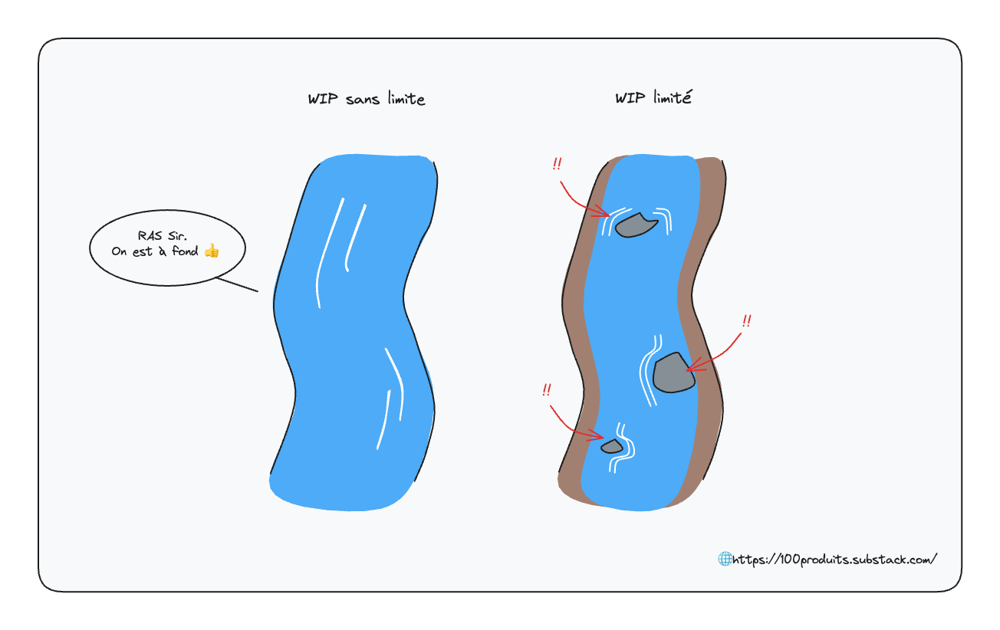
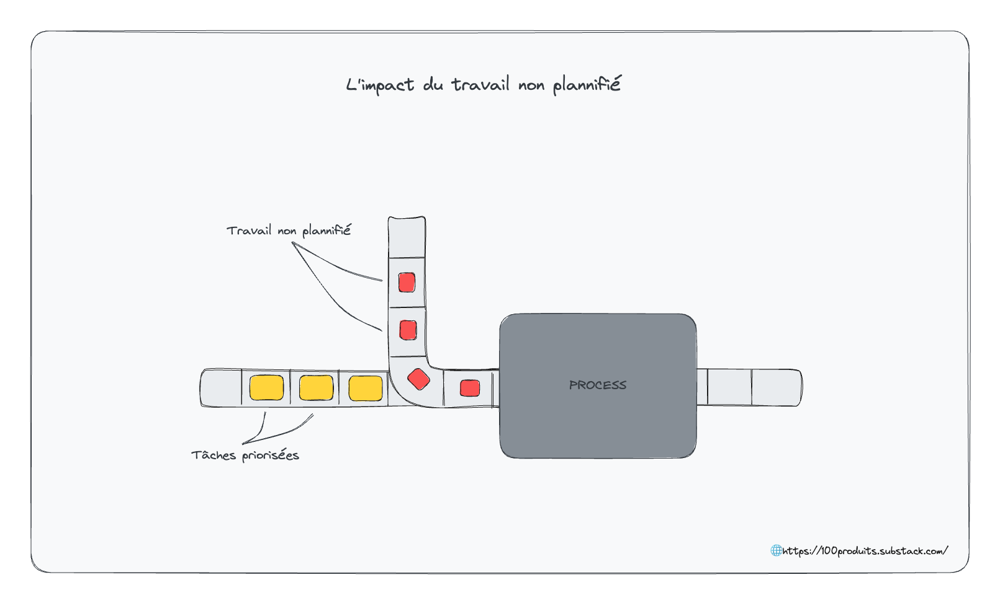

Hello ! 

Ces derniers mois, j'ai beaucoup lu sur le DevOps. 

Dans l'<a href="https://100produits.substack.com/p/devops-101">édition précédente</a>, nous avons approché une outline de la discipline formée par les grands principes et techniques qui la composent. 

Dans cette édition, j'ai regroupé les réalisations que j'ai eues et les concepts qui m'ont le plus marqué. 

Avant de plonger, voici un récapitulatif des livres que j'ai lu.

Inspiration et mindset :
<ul><li>
The Phoenix Project
</li><li>
The DevOps Handbook
</li><li>
The Goal - A process of ongoing improvement 
</li><li>
Toyota Production System (TPS)
</li><li>
Lean Startup
</li></ul>

Technique et outils :
<ul><li>
Quick Start Kubernetes
</li><li>
Learn Kubernetes in a Month of Lunches
</li><li>
Automating DevOps With GitLab CICD Pipelines
</li></ul><ul><li>
OpenShift in Action (beaucoup de contenu déprécié)
</li></ul>

Et voici les idées qui m’ont le plus marqué. 🤸

<h1>Les concepts</h1><h2>Shit happens</h2>
Le fait que des problèmes apparaissent est normal. 

L'enjeux n'est pas de prévenir et d'anticiper tous les problèmes, mais que lorsqu'un problème survient, il soit détecté rapidement, que l'on s'empresse de le résoudre, puis que des mesures soient prises afin que le cas n'apparaisse plus - ou à minima qu'il soit documenté afin que si le problème apparaît de nouveaux, il soit rapide à résoudre.

Jusqu'à présent, je voyais les problèmes comme des échecs dans le processus de développement. Maintenant, je considère que les problèmes et <strong>les erreurs font partie du processus</strong>. Ils peuvent être accueillis sans jugement et <strong>l'enjeu est de savoir comment tu y réponds</strong>. 

Lorsque l'on renverse la perspective, on se rend compte que les problèmes sont même d'excellentes opportunités d'apprendre. 

<h2>La roue des problèmes</h2>
Les problèmes sont le point de départ du processus d'amélioration continue. 

Améliorer un système consiste simplement à :

1. Identifier les problèmes que l'on rencontre

2. Les prioriser

3. Les adresser un par un

4. Implémenter / diffuser la solution

Parmi les outils à notre disposition pour identifier les problèmes dans le cycle de développement, on retrouve : 
<ul><li>
le daily, les rétrospectives, les 1:1, les pre-mortems et les post mortems : pour identifier au plus tôt les problèmes humains ainsi que les blocages et les problèmes d'organisation
</li><li>
la télémétrie et les outils de monitoring pour identifier les problèmes en production
</li><li>
les outils d'intégration continue (tests, analyseurs statiques) pour identifier les problèmes dans le code que l'on s'apprête à intégrer dans la codebase.
</li><li>
l'état d'esprit <em>fail fast</em> qui consiste à faire exploser les problèmes rapidement afin de réduire la distance entre la détonation et la source du problème
</li></ul>
Pour les prioriser les problèmes identifiés, on peut : 
<ul><li>
tenir à jour une liste des problèmes qu’on rencontre
</li><li>
utiliser des outils comme StepSize pour suivre les zones de code à refactorer
</li></ul>
Pour les adresser et réussir à avancer, avoir un mindset d'expérimentation aide. Parfois il faut payer pour voir. Lorsque Netflix a produit sa première série, ils pensaient que cela n'allait pas marcher. Ils ont quand même mis le paquet, pour voir, et l'expérimentation c'est avéré un succès. Quand, on en est toujours au même point six mois après avoir identifié un problème, notre système d'amélioration est cassé.

Pour partager les enseignements au niveau de l'équipe et de l'entreprise, il est intéressant de documenter l'erreur et la solution dans un système de gestion des connaissances accessible à tous comme GitLab, Confluence, Notion. 

<h2>Mean time to recover (MTTR)</h2>
Le Mean Time To Recover mesure le temps moyen que met un système à revenir à la normale après l'apparition d'un problème. C'est une métrique clé chez les Top performeurs. Lorsqu'il se compte en secondes, en minutes, en heures, il est un indicateur de bonne performance et de réactivité. Lorsqu'il se compte en jours, en semaines et en mois, il laisse supposer de profonds problèmes d'organisation.

Mr Culbuto a un très bon MTTR. On peut l’incliner et il revient vite à la normale. Be a culbuto.

<h2>Le coût du retard à détecter et du report de correction</h2>
Le coût d'un problème est proportionnel à sa durée d'existence.

On s'accorde souvent sur le fait que plus un problème est détecté tardivement, plus son coût est élevé. Un bug détecté dans la chaîne d'intégration continue n'impacte personne et est rapide à résoudre car le contexte est encore frais. S'il est détecté en production par les utilisateurs, il a un impact négatif sur leur expérience, sur l'image qu'ils se font du service et il est plus cher à résoudre puisqu'il faut en plus gérer les éventuels dégâts qui ont été causés par le problème.

Plus un problème est détecté tardivement, plus son coût de résolution est élevé.

Mais détecter un problème rapidement ne fait pas tout. Il faut ensuite l'adresser. Tant qu'il n'est pas adressé, il reste dans un coin de ta tête. Il se rappelle à toi chaque dans le backlog. Il encombre le work-in-progress. Il devient un cailloux dans la chaussure avec lequel on s'habitue à marcher. Une charge mentale quoi.

L'enjeu ici est donc 
<ol><li>
de détecter les problèmes au plus tôt, puis 
</li><li>
de les résoudre au plus vite.
</li></ol>

Jump into action.

<h2>Les kaizen blitzes</h2>
Un Kaizen Blitz est une période ou l'équipe met en pause de développement de nouvelles fonctionnalités pour régler un problème qu'elle rencontre. 

On peut voir cela comme : 
<ul><li>
un sprint de refactoring
</li><li>
un hackathon d'amélioration continue
</li><li>
un grand coup de ménage avec un tour de lave-vaisselle
</li></ul>

Voici quelques exemples de Kaizen Blitz : 
<ul><li>
Le Christmas Refactoring chez Agicap. Après l'arrivée de Thomas Pierrain chez Agicap, les équipes ont mis en pause le développement de nouvelles features pendant 3 semaines au moment de fêtes de Noël afin de se concentrer sur des tâches de refactoring et d'amélioration du code existant. 
</li><li>
L'expérimentation Operation Inversion chez LinkedIn où les équipes ont mis en pause le développement de nouvelles features pendants plusieurs mois afin de concentrer leur énergie sur l'amélioration du pipeline de déploiement et la réduction de la Dette technique. 
</li></ul>

Logo d’une marque de tablettes de lave-vaisselle

<h2>Le Chaos Monkey</h2>
Il n'y a rien de pire qu'un système de sécurité qui ne fonctionne pas : tu te comportes comme si tu étais en sécurité, mais tu es sans filet.

Une bonne façon de tester la résistance du système face aux problèmes que l'on s'attend à subir est d'en injecter soi-même régulièrement. Une fois le système testé dans des conditions favorables, il est intéressant de s'intéresser aux scénarios en conditions d'intempéries. 

Le Chaos Monkey de Netflix est une implémentation extrême. 

Une illustration du Chaos Monkey de Netflix par sketchplanations.com

Afin de vérifier que le système a bien le niveau de résilience attendu, il tue volontairement des processus et des serveurs de façon aléatoire. De cette façon, les mécanismes de résilience sont régulièrement sollicités et l'on est serein sur le fait qu'ils fonctionnent bien. 

Dans sa démarche d’anti-fragilité, Netflix va même encore plus loin avec toute une armée de monkeys :

Une illustration des différents daemons qui opèrent sur le cloud de Netflix par @geosley

<h2>Le Flow</h2>
Le flow désigne le flux des items dans la chaîne de valeur. 

Tout l'enjeu du Lean Manufacturing, du DevOps et de l'agilité est de fluidifier le flux des opérations pour permettre au système de réagir rapidement aux demandes du marché, tout en réduisant les dépenses opérationnelles et en travaillant avec juste ce qu'il faut d'inventaire.

Le flow est au centre de l'attention.

<h2>Le Work In Progress</h2>
Le work-in-progress (WIP) est la somme des tâches démarrées et non terminées. 

Comme l'explique Erik (le mentor) dans The Phoenix Project :
<blockquote>
Work-in-progress is the silent killer
</blockquote>
Lorsque l'on se retrouve bloqué sur une tâche, nous avons tendance à démarrer de nouvelles tâches plus faciles en attendant de trouver une solution pour la première. On cherche à "paralléliser". Rapidement, les tâches ouvertes et non complétées s'accumulent. Cette accumulation de tâche démarrée ne crée aucune valeur et représente une charge mentale qui grossit et pèse de plus en plus sur l'équipe.

Limiter le WIP a deux grands bénéfices. D'abord, il permet de réduire l'encombrement dans la chaîne de création de valeur, et ainsi d'améliorer le temps écoulé entre une idée et sa réalisation (lead time). Ensuite, il accentue la gêne causée par les bloqueurs, ce qui les rend d'autant plus urgents à résoudre.

Taiichi Ohno, un des pères fondateurs du Lean Manufacturing, compare la pratique de limiter le WIP à <em>drainer la rivière de l'inventaire afin de révéler tous les problèmes qui entravent un flux rapide</em>.

Limiter le WIP révèle les problèmes

Limiter le WIP permet d’identifier les problèmes. 

Cela nous permet ensuite de les adresser et de gagner en efficacité.

<h2>Bien vivre dans un système complexe</h2>
Il est possible de travailler dans un système complexe de façon sûre en suivant les principes suivants : 
<ul><li>
Transparence opérationnelle : les problèmes sont révélés
</li><li>
Les problèmes sont résolus afin de gagner en connaissance
</li><li>
Les connaissances crées localement sont diffusées et exploitées globalement
</li><li>
Les pratiques sont perpétuées par le management
</li></ul>

<h2>La Loi de Gall</h2>
La loi de Gall est une règle empirique énoncée par John Gall dans _Systemantics: How Systems Really Work and How They Fail_ : 
<blockquote>
A complex system that works is invariably found to have evolved from a simple system that worked. A complex system designed from scratch never works and cannot be patched up to make it work. You have to start over with a working simple system. 
</blockquote>
Dis autrement : si tu veux un système complexe qui fonctionne, construit un système simple qui fonctionne puis améliore-le de façon itérative. Pars de spécifications minimales, et affine. N’essaie pas de résoudre tous les problèmes d’un coup. Identifie les besoins essentiels, réduit le focus, et démarre avec un MVP.

<h2>Knowledge holders</h2>
Un détenteur de connaissance est une personne qui accumule du savoir sur le fonctionnement de l'entreprise mais le garde pour lui, de façon intentionnelle ou non. 

Ce type de profil se trouve régulièrement dans une posture de Héro car il est la personne qui te sort de l'ornière. Il est hautement valorisé par l'entreprise, mais il est aussi un de ses points faibles.

D'abord parce que ces personnes ne sont <strong>pas scalables</strong>. Lorsque les projets grandissent, elles deviennent un bottleneck car tout le monde dépend de ces personnes pour avancer.

Ensuite, elles présentent un risque pour l'entreprise, si elles gagnent au Loto.

Les knowledge holders sont souvent des personnes talentueuses techniquement. Pour capitaliser sur leur connaissance, il est intéressant 
<ol><li>
de tracer toutes les demandes qui leur parviennent puis
</li><li>
documenter les actions qu'elles réalisent régulièrement.
</li></ol>

<h2>Les 4 formes de travail dans l'IT</h2>
On distingue 4 formes de travail dans l'IT
<ul><li>
les projets business à destination des clients externes
</li><li>
les projets internes à l'entreprise
</li><li>
les changements et évolutions
</li><li>
le travail non planifié (⚠️)
</li></ul>
Le travail non planifié est la matière noire du système : il est invisible, mais bien présent. Et <strong>il empêche de travail qui a été planifié d'être exécuté</strong>. Il est souvent constitué d'incidents de production et de travail urgent mais non important. 

Lorsque l’on se retrouve à travailler dans la réaction, aka mode Pompier, les tâches sont dominées par du travail non planifié.

Le travail non planifié est à traquer et à éliminer. La meilleure façon de le suivre est de rendre le travail visible grâce à des outils de management visuel comme kanban ou scrum board.

<h2>L’Amélioration Continue</h2>
Améliorer ce que tu fais est plus important que ce que tu fais : peu importe d'où tu pars. Dès lors que tu es capable de t'améliorer, tu es capable de faire mieux. Et plus vite tu t'améliores, plus vite tu dépasses ton niveau initial.

L'amélioration continue consiste à améliorer les processus et le travail quotidien. C'est un processus et une habitude qui se manifeste par des activités comme les Kaizen Blitzes, les post-mortems, les rétrospectives.

Le plus gros frein à l’amélioration continue est l’état d’esprit. Si on part du principe qu’une piste de solution à un problème ne va pas marcher, et que l’on préfère rester dans le confort de faire comme on a toujours fait, on stagne. On ne résout pas les problèmes que l’on rencontre. Et par inertie, la situation tend même à se détériorer.

Une approche constructive consiste à expérimenter de façon structurée en explicitant les hypothèses que l’on cherche à vérifier, en donnant un cadre temporel à l’expérimentation, et en mesurant les résultats à l’issue de l’expérimentation. 

Certaines vont améliorer les choses. D’autres vont les empirer. 

Il s’agit alors d’absorber ce qui fonctionne pour toi, et de rejeter ce qui ne l’est pas.

<h1>Conclusion</h1>
Voilà pour aujourd'hui. 

J’espère que tu auras trouvé ici certaines idées qui te seront utiles au quotidien :)

 À la prochaine !

Alex

