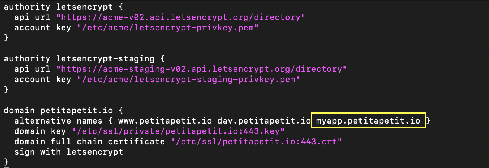
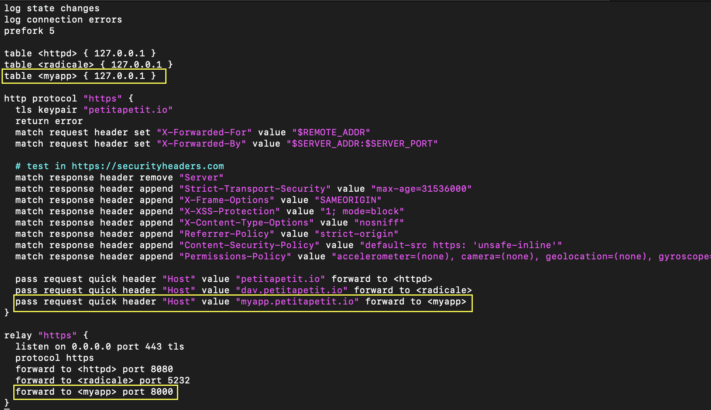

### Why ? 

Why would I do that ? 

Here are 5 reasons that motivated me :
- it's economical (only 5$/month + the price of your domain name)
- it's easy (just follow this tutorial)
- it's empowering
- it's simple
- it's fun

Another reason that pushed me is mimesis.
Pieter Levels deploy his index.php files on his own server.
Derek Sivers run all his business on it's own sever. 
Hackers do it. It looks exciting.

So, here is the plan :
- Setup your server
- Make a simple python web app
- Add your subdomain to your certificate
- Route trafic to your web app
- Create amazing projects

### Setup the instance

This article sit on the shoulders of https://sive.rs/ti.

Follow it to setup your own server. Derek's article will lead you to a simple, secure, and powerful setup.

His guide is frequently updated. But still, things can go wrong. If it does, start over. You'll be amazed how fast you can go. If it still doesn't work, yo are lucky. It's an opportunity to learn and help. Read the `ti.sh` source instructions. Dig the man pages. It's most certainly not a big thing and you will learn a lot.

By the end of the article, you are equipped with your own server. Setup of e-mail, calendar and contacts is out of scope in our case. If you seize the opportunity, great :).

### Create a simple app


1. Connect to your server with ssh
2. Run `whoami` and note your username (mine is just `a`)
3. Install python : 
```sh
doas pkg_add python
```
4. Create a folder for your app 
```sh
cd /var/www/
doas su
mkdir myapp
chown -R <username>:<username> myapp  # for me it's `chown -R a:a myapp`
exit
```
4. Download code of your app
```
cd myapp
curl -O https://petitapetit.io/pub/app.py
```

5. Create a virtual environment and install the dependencies
```
python3 -m venv .venv
. .venv/bin/activate
pip install --upgrade pip
pip install flask
pip install gunicorn
```

6. Test that it works locally
```sh
# Serve the web app
gunicorn app:app --workers 1 --bind 127.0.0.1:8000 --daemon
# Browse it. You should the html content of the page.
curl 127.0.0.1:8000

# Stop 
ps aux | grep gunicorn
kill -9 <GUNICORN_PID>
```

7. Configure a daemon

Create a file `/etc/rc.d/myappd` with this content : 
```
#!/bin/ksh

daemon="/var/www/myapp/.venv/bin/gunicorn" 
daemon_flags="app:app --daemon --workers 2 --bind 127.0.0.1:8000 --chdir /var/www/myapp"

. /etc/rc.d/rc.subr

rc_user="www"
rc_env="PATH=/var/www/myapp/.venv/bin:/usr/bin:/bin"

rc_start() {
    echo "Start the myapp gunicorn daemon"
    ${rcexec} ${daemon} ${daemon_flags}
}

rc_check() {
    pgrep -f "/var/www/myapp/.venv/bin/python3 /var/www/myapp/.venv/bin/gunicorn app:app" >/dev/null
}

rc_stop() {
    echo "Kill the myapp gunicorn workers"
    pkill -f "/var/www/myapp/.venv/bin/python3 /var/www/myapp/.venv/bin/gunicorn app:app" 
}

rc_cmd $1
```

9. Enable the daemon so that it will start automatically if you reboot your server.
```
rcctl enable myappd
```
10. Start your daemon
```
rcctl start myappd
```

In case of troubles, read `man rcctl` or try `/etc/rc.d/myappd -d start` to start the deamon manually and see the logs.


### Add your subdomain to your certificate


1. Add your subdomain to the acme-client configuration. 

To do so, edit `/etc/acme-client.conf` and add your subdomain to the list of `alternative names` of your domain.

Here is how the modification look on my side : 



2. Renew your certificate 
```sh
doas acme-client -v <your-domain> # for me it's `doas acme-client -v petitapetit.io`
```

### Route the trafic to your web app

1. Update your relayed configuration to route requests made to your subdomain toward your web app. Add the following lines 


2. Apply the changes and load the new certificate 
```
doas rcctl reload relayd
```
3. Open a browser and try to browse your subdomain

For the purpose of this tutorial, it would be `https://myapp.petitapetit.io` on my server. You can visite https://leequotes.petitapetit.io to see a web application that I'm actively serving.

### Conclusion

You can now deploy an infinite number of python web apps, on your own server. 

How does it feel ? 

If something goes wrong, please give me a description of what goes wrong at what step. If you make it work, please tell me. I would be happy to know it helped you. Finally, if you see something that can be improved, please tell me too. 


